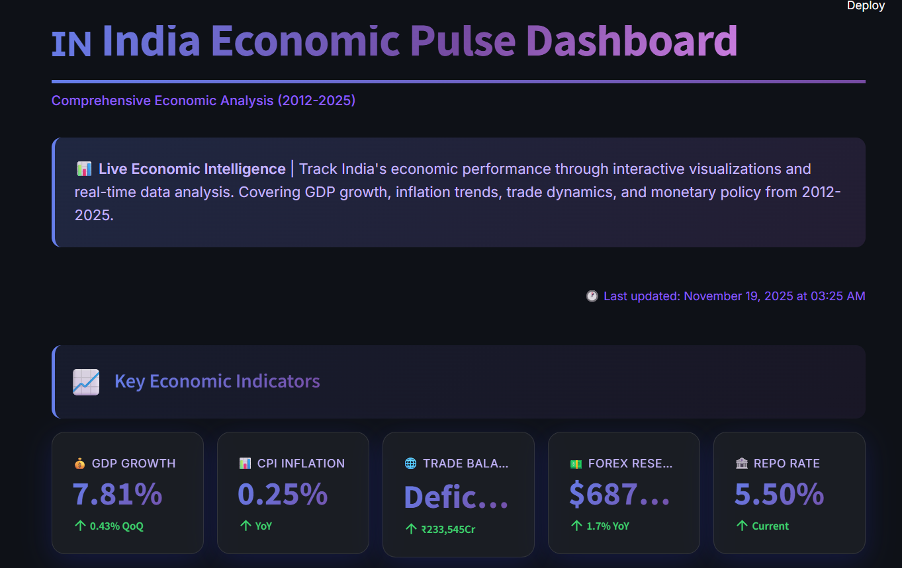
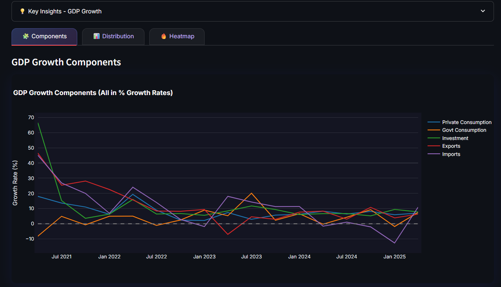
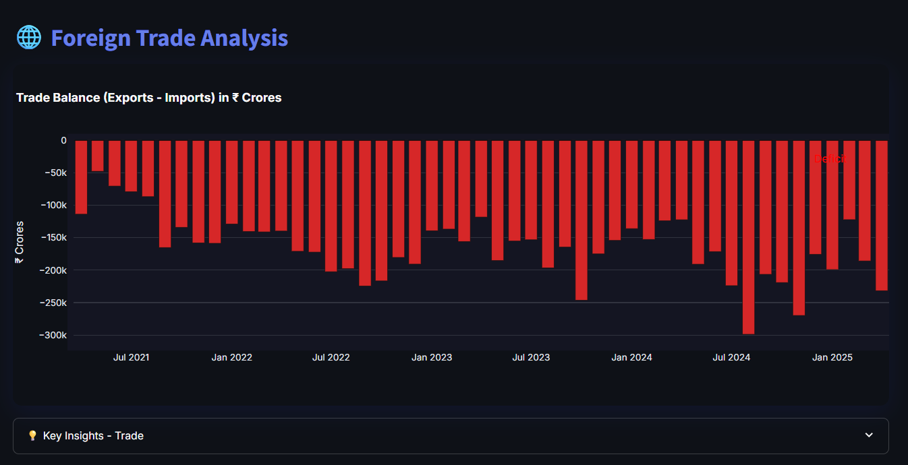

# 🇮🇳 India Economic Pulse Dashboard


> **A comprehensive, real-time economic analytics dashboard tracking India's key economic indicators from 2012-2025**

[](YOUR-DEPLOYED-URL-HERE)
[](https://www.python.org/downloads/)
[](https://opensource.org/licenses/MIT)

## 📊 Overview

India Economic Pulse is an interactive data visualization dashboard that consolidates and analyzes 10+ key Indian economic indicators. Built with Streamlit and Plotly, it transforms complex economic data into actionable insights through beautiful, interactive visualizations.

### ✨ Key Features

- **📈 GDP Analysis**: Track quarterly growth rates with moving averages and component breakdowns
- **💰 Inflation Tracking**: Monitor CPI and WPI trends with RBI target comparisons
- **🌐 Trade Dynamics**: Analyze import-export balance and trade composition
- **💵 Forex & Policy Rates**: Real-time forex reserves and RBI monetary policy rates
- **📊 Multiple Visualizations**: Line charts, bar charts, heatmaps, box plots, and pie charts
- **🎨 Modern UI**: Dark theme with glassmorphism effects and smooth animations
- **📥 Data Export**: Download filtered data as CSV or complete datasets as Excel
- **⚡ Auto-refresh**: Daily automated data updates

## 🎯 Live Demo

**[View Live Dashboard →](YOUR-DEPLOYED-URL-HERE)**

## 📸 Screenshots

### Dashboard Overview


### GDP Growth Analysis


### Trade Balance View


## 🏗️ Tech Stack

- **Frontend**: Streamlit
- **Data Processing**: Pandas, NumPy
- **Visualizations**: Plotly
- **Data Sources**: 
  - Ministry of Statistics and Programme Implementation (MoSPI)
  - Reserve Bank of India (RBI)
  - Directorate General of Commercial Intelligence and Statistics (DGCI&S)

## 📊 Indicators Tracked

| Category | Indicators | Update Frequency |
|----------|-----------|------------------|
| **GDP** | Growth rate, Components (PFCE, GFCE, GFCF) | Quarterly |
| **Inflation** | CPI, WPI, Rural/Urban breakdown | Monthly |
| **Trade** | Exports, Imports, Trade balance | Monthly |
| **Forex** | Total reserves, Gold, FCA composition | Weekly |
| **Monetary** | Repo rate, Reverse repo, CRR, SLR | As announced |

## 🚀 Quick Start

### Prerequisites

- Python 3.9 or higher
- pip package manager

### Installation

1. **Clone the repository**
```bash
git clone https://github.com/rkjat65/india-economic-pulse.git
cd india-economic-pulse
```

2. **Install dependencies**
```bash
pip install -r requirements.txt
```

3. **Run the dashboard**
```bash
streamlit run app.py
```

4. **Open your browser**
Navigate to `http://localhost:8501`

## 📁 Project Structure
```
india-economic-pulse/
├── app.py                    # Main Streamlit application
├── data_fetcher.py          # Data loading and processing module
├── visualizations.py        # Chart creation functions
├── requirements.txt         # Python dependencies
├── raw_data/               # Source Excel files
├── data/                   # Processed CSV cache
├── assets/                 # Screenshots and images
└── README.md
```

## 🎨 Features Deep Dive

### Data Processing
- Automated data cleaning and normalization
- Intelligent handling of missing values
- Year-over-year and quarter-over-quarter calculations
- Moving averages and trend analysis

### Interactive Filters
- Multi-year selection
- Dynamic date range filtering
- View switching (GDP, Inflation, Trade, Forex, All Indicators)

### Visualizations
- **Line Charts**: Trend analysis with moving averages
- **Bar Charts**: Growth rate comparisons
- **Heatmaps**: Quarterly growth patterns
- **Box Plots**: Distribution analysis
- **Pie Charts**: Composition breakdowns
- **Dual-axis Charts**: Multiple metrics correlation

## 📝 Data Sources & Attribution

All data sourced from official Indian government publications:
- **GDP & National Accounts**: [MoSPI](https://www.mospi.gov.in/)
- **Inflation Indices**: [RBI Database](https://dbie.rbi.org.in/)
- **Trade Statistics**: [DGCI&S](https://commerce.gov.in/)
- **Forex Reserves**: [RBI Weekly Reports](https://www.rbi.org.in/)

## 🤝 Contributing

Contributions are welcome! Here's how you can help:

1. Fork the repository
2. Create a feature branch (`git checkout -b feature/AmazingFeature`)
3. Commit your changes (`git commit -m 'Add some AmazingFeature'`)
4. Push to the branch (`git push origin feature/AmazingFeature`)
5. Open a Pull Request

## 📈 Roadmap

- [ ] Add district-level economic indicators
- [ ] Implement forecasting models (ARIMA, Prophet)
- [ ] Create API for programmatic access
- [ ] Add email alerts for significant changes
- [ ] State-wise comparative analysis
- [ ] Sector-specific deep dives

## 📄 License

This project is licensed under the MIT License - see the [LICENSE](LICENSE) file for details.

## 👤 Author

**Your Name**

- Portfolio: [rkjat.in](https://rkjat.in)
- LinkedIn: [@rkjat](https://linkedin.com/in/rkjat)
- GitHub: [@rkjat65](https://github.com/rkjat65)
- Twitter: [@rkjat65](https://twitter.com/rkjat65)

## 🙏 Acknowledgments

- Data provided by Government of India agencies
- Built with [Streamlit](https://streamlit.io/)
- Visualizations powered by [Plotly](https://plotly.com/)
- Inspired by the need for accessible economic data analysis

## 📞 Contact

Have questions or suggestions? Feel free to reach out!

- **Email**: your.email@example.com
- **LinkedIn**: [Connect with me](https://linkedin.com/in/rkjat)
- **Issues**: [GitHub Issues](https://github.com/rkjat65/india-economic-pulse/issues)

---

⭐ **If you found this project helpful, please give it a star!**

Built with ❤️ for data-driven insights into India's economy